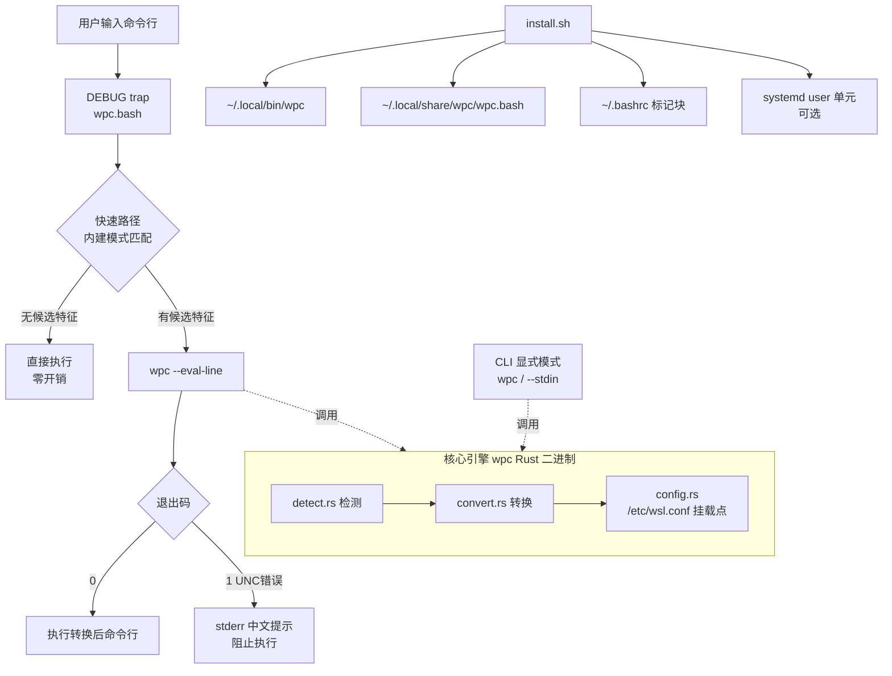

# wpc 软件开发方案（阶段一，不含测试）

> 版本：v1.0　日期：2026-08-27
> 用途：供其他智能体（`path-convert-developer` 代理）据此完成开发任务。
> 范围：**仅阶段一（功能开发）**；一切测试相关内容（测试框架、用例、测试阶段安排）见末尾「留给测试阶段的内容」，本阶段禁止实施。

## 1. 目标与范围

### 1.1 总体目标

在 WSL（Ubuntu，bash 5.2）中安装一个工具，使用户在日常使用中**无感知**地将 Windows 路径自动转换为 WSL 路径：

```bash
# 用户输入
some_command C:\Users\username\Documents\file.txt
# 实际执行
some_command /mnt/c/Users/username/Documents/file.txt
```

### 1.2 阶段一交付物

| 交付物 | 形态 | 对应 skill |
|--------|------|-----------|
| 核心路径转换引擎 | Rust 零依赖单二进制 `wpc` | `path-conversion-engine` |
| bash 无感集成 | `shell/wpc.bash`（DEBUG trap hook） | `bash-preexec-integration` |
| 安装/卸载与自启动 | `install.sh` / `uninstall.sh` + systemd 单元 | `installer-and-autostart` |
| 文档 | README、架构文档、冒烟记录 | `project-documentation` |

### 1.3 非目标（明确不做）

- 自动化测试（测试框架、测试用例、CI）——留待后续阶段。
- zsh/fish 支持——后续阶段。
- Windows 侧工具（如 PowerShell 侧的反向转换）——后续阶段。
- 脚本/非交互场景的自动转换（见 4.3 限制）。

## 2. 需求分析

### 2.1 需求逐条解读

| 需求原文要点 | 解读 | 方案响应 |
|--------------|------|----------|
| 发行版启动时自动启动并进入服务状态 | bash 场景下无独立守护进程可挂；「服务状态」= 每次交互式 shell 启动时 hook 自动激活 | bashrc 注入 + 可选 systemd user 单元作为服务化体现 |
| 调用命令或脚本传参时输入 Windows 路径，自动转换并替换参数后执行 | 交互式命令行为第一优先级；脚本场景仅在显式 CLI 模式下支持（`wpc` 被脚本调用） | DEBUG trap 拦截 + CLI 显式模式 |
| 无感知、无显式调用或提示（除非错误） | 转换层不产生任何正常路径输出；只有错误才提示 | 快速路径零输出；错误走 stderr 中文提示 |
| 安装于 WSL（ubuntu） | 用户级安装，不污染系统 | `~/.local/bin` + `~/.local/share/wpc` |

### 2.2 关键场景清单

| 场景 | 输入 | 预期 |
|------|------|------|
| S1 命令参数含盘符路径 | `cat C:\Users\x\a.txt` | 执行 `cat /mnt/c/Users/x/a.txt` |
| S2 含空格路径（引号） | `ls "C:\Program Files\Foo"` | 执行 `ls "/mnt/c/Program Files/Foo"` |
| S3 混合参数 | `diff C:\a.txt /home/u/b.txt` | 仅转换 Windows 部分 |
| S4 正斜杠盘符路径 | `cat C:/Users/x/a.txt` | 执行 `cat /mnt/c/Users/x/a.txt` |
| S5 UNC 路径 | `ls \\server\share\x` | 错误提示并阻止执行 |
| S6 非路径误伤防护 | `echo C:`、`grep -E 'C:\\foo'` | 不转换 |
| S7 脚本内显式调用 | `wpc 'C:\a.txt'` | 输出 `/mnt/c/a.txt`（显式模式，脚本可消费） |
| S8 临时禁用 | `WPC_DISABLE=1 cat C:\a.txt` | 不转换 |

## 3. 架构设计

### 3.1 组件图



### 3.2 模块职责

| 模块 | 文件 | 职责 |
|------|------|------|
| CLI 入口 | `src/main.rs` | 子命令分发、退出码 |
| 检测引擎 | `src/engine/detect.rs` | 识别 Windows 路径（上下文感知） |
| 转换引擎 | `src/engine/convert.rs` | 盘符/分隔符/挂载点映射 |
| 配置 | `src/config.rs` | 读取 `/etc/wsl.conf` automount root、`~/.config/wpc/config.toml` |
| hook 入口 | `src/hook.rs` | `--eval-line` 模式（整体替换原始命令行） |
| Shell 集成 | `shell/wpc.bash` | DEBUG trap、快速路径、错误处理 |
| 部署 | `install.sh` / `uninstall.sh` / `deploy/wpc-daemon.service` | 用户级安装、幂等、可逆 |

## 4. 技术选型

### 4.1 拦截机制选型

| 候选方案 | 原理 | 优点 | 缺点 | 结论 |
|----------|------|------|------|------|
| **bash DEBUG trap（preexec）** | 每次提示符前 trap 捕获 `$BASH_COMMAND` | 纯 bash、无系统级风险、安装卸载可逆、对"命令文本"整体处理（可还原空格） | 仅交互式 bash 生效 | ✅ 采用 |
| LD_PRELOAD 拦截 execve | 共享库替换系统调用 | 全进程生效（含脚本） | 高风险：易导致崩溃/安全绕过；调试困难；全局污染 | ❌ 风险过高 |
| shell 函数包装 PATH | 为每个命令生成包装函数 | 概念简单 | 需枚举命令、无法覆盖绝对路径调用、维护成本高 | ❌ 覆盖面不足 |
| command_not_found_handle | 命令不存在时触发 | 简单 | 无法在命令存在时拦截，仅能补漏 | ⚠️ 可选附加 |

**结论**：主方案为 bash DEBUG trap；`command_not_found_handle` 作为可选附加项（后续阶段评估）。

### 4.2 引擎语言选型

| 候选 | 优点 | 缺点 | 结论 |
|------|------|------|------|
| **Rust** | 零依赖单二进制、执行开销微秒级（hook 热路径关键）、类型安全 | 开发成本略高 | ✅ 采用（rustc 1.96 已装，无外部 crate） |
| Python 3 | 开发快 | 解释器启动 ~30ms/次，在每条命令热路径上不可接受；依赖环境 | ❌ |
| 纯 bash | 零部署 | 复杂转义/引号处理极易出错，难以正确处理空格与引号组合 | ⚠️ 仅作快速路径预筛 |

**结论**：Rust 实现核心；bash 只做「快速路径预筛」，把绝大多数普通命令挡在引擎之外。

### 4.3 限制（本阶段明确接受）

1. 仅交互式 bash（含 bashrc 加载的 bash -i）；脚本内直接写 Windows 路径不会被自动转换（脚本可用 `wpc` CLI 显式转换）。
2. UNC 路径（`\\server\share\...`）无法映射到 WSL 路径（WSL 无对应挂载点），按错误处理。
3. 带空格且未加引号的 Windows 路径在命令分词后语义已变，hook 层按「原始文本整体替换」策略尽量还原，但无法覆盖所有极端情况。
4. 相对盘符路径（`C:foo`，无分隔符）不转换。

## 5. 路径转换规则（引擎实现规范）

### 5.1 检测规则

1. **盘符绝对路径**：匹配 `[A-Za-z]:[\\/]` 开头，且其后有至少一个非空白字符。
2. **UNC 路径**：匹配 `\\` 开头且后跟非 `\` 字符；识别后标记为错误类别 `UnsupportedUnc`（不输出转换结果）。
3. **上下文约束**：候选串必须位于以下位置之一，否则视为非路径不转换：
   - 行首；
   - 空白字符之后；
   - 引号（`"` 或 `'`）之后且该引号内内容以候选串开头。
4. **误伤防护（不转换清单）**：
   - `C:` 后无 `\` 或 `/`（如 `echo C:`）；
   - 候选前是 `http://`、`https://` 等 URL scheme 一部分；
   - 候选在环境变量展开 `${VAR}` 或 `$VAR` 内；
   - 反斜杠本身被 shell 转义的情形（`BASH_COMMAND` 中呈现为 `\\` 的，需先还原再判断，实现时以 `BASH_COMMAND` 实际文本为准）。

### 5.2 转换规则

1. 盘符字母 → 小写；`\` → `/`；连续多个 `\` 或 `/` 归一为一个 `/`。
2. 盘符 `X:` → `<root>/x`，其中 `<root>` 默认 `/mnt/`，读取顺序：
   a. `/etc/wsl.conf` 的 `[automount] root`（若存在且合法）；
   b. `~/.config/wpc/config.toml` 的 `mount_root`（若存在）；
   c. 默认 `/mnt/`。
3. 引号风格保持：原文用双引号包裹 → 输出双引号包裹；单引号同理；无引号 → 无引号输出。
4. 输出不做 shell 转义——由调用方（hook 的执行替换策略）负责保证执行安全（见 §6）。

### 5.3 CLI 接口与退出码

```
wpc <路径...>                # 逐参数转换，每行一个；非路径参数原样输出
wpc --stdin                  # stdin 多行 → stdout 逐行转换
wpc --eval-line <原始命令行>  # 整体替换，供 hook 使用
wpc --version
```

退出码：`0` 成功（含无匹配）；`1` 存在 UNC 无法转换；`2` 用法错误。

## 6. 执行替换策略（关键难点）

bash 无原生 preexec，必须在不破坏用户体验的前提下完成「替换并执行」：

1. **捕获**：DEBUG trap 中读 `$BASH_COMMAND`（交互式下为原始命令行文本）。
2. **快速路径**：bash 内建模式 `[[ $cmd == *[A-Za-z]:[\\/]* || $cmd == *\\\\* ]]` 预筛；不满足直接放行（零 fork）。
3. **替换**：满足预筛时调用 `wpc --eval-line "$cmd"`：
   - 退出码 0：得到 `converted`，通过以下方式执行（实现按序尝试，取首个可行）：
     a. 将 `converted` 写入临时文件 + `source`，同时 `history -s "$cmd"` 保留用户原文进历史；或
     b. 若 a 不可行，则 `eval` 前置安全审计（见第 4 点）后执行。
   - 退出码 1：stderr 输出 `wpc: 无法转换 Windows UNC 路径，命令未执行：<原文>` 并阻止执行；若 `WPC_FALLBACK=raw` 则原样放行。
4. **执行安全**：`converted` 仅由检测规则（§5.1 上下文约束）限定边界，替换只作用于被识别为路径的子串，其余命令文本逐字保留，不引入新转义。**禁止**对整行做二次拼接重写。
5. **防递归**：全局标志 `__wpc_in_hook=1`；hook 内部命令（含 `wpc` 调用、`history` 写入）执行前设置 `WPC_DISABLE=1` 环境，结束后恢复。
6. **感知最小化**：正常路径下终端无任何额外输出；命令回显（`set -x` 时除外）与历史记录保持用户原文。

## 7. 安全与错误处理

| 风险 | 对策 |
|------|------|
| hook 递归/死循环 | `WPC_DISABLE` + `__wpc_in_hook` 双保险 |
| 误转换导致危险命令执行 | 上下文约束（§5.1）+ 快速路径只在明确候选时进入引擎；`wpc` 二进制输入永不过 shell 二次解析 |
| `wpc` 不可用/被杀 | hook 检测命令不存在时直接放行原命令，不阻断用户 |
| 挂载点被用户自定义 | 引擎读 `/etc/wsl.conf` 与用户配置，转换结果始终与实际挂载一致 |
| 安装污染 | 全部用户级路径；bashrc 仅追加标记块；卸载可逆 |
| UNC 无法转换 | 明确错误类别 + 阻止执行 + 提示；`WPC_FALLBACK=raw` 可逃生 |
| 中文/Unicode 路径 | Rust `String` 全程按 UTF-8 处理，不做字节级截断 |

## 8. 任务分解（TODO → skill）

> 按 require.md 要求：每个 TODO 项目做成一个完整 skill（已完成，位于 `.github/skills/`）。

| # | TODO（skill） | 产出 | 预估提交点 | 依赖 |
|---|---------------|------|-----------|------|
| 1 | `scaffold-rust-project` | Cargo 工程 + 模块骨架 + 可编译二进制 | 1 次 commit | 无 |
| 2 | `path-conversion-engine` | 检测/转换引擎 + CLI 全接口 | 1 次 commit | 1 |
| 3 | `bash-preexec-integration` | `shell/wpc.bash` hook | 1 次 commit | 2 |
| 4 | `installer-and-autostart` | install/uninstall + systemd 单元 | 1 次 commit | 3 |
| 5 | `project-documentation` | README/架构/冒烟汇总/验收核对 | 1 次 commit | 4 |

执行顺序：1 → 2 → 3 → 4 → 5（严格串行，每步完成即 commit）。

## 9. 阶段一验收清单（手动冒烟，非自动化测试）

> 全部通过即阶段一完成。由 `project-documentation` skill 汇总记录于 `docs/smoke-checklist.md`。

- [ ] A1 `wpc 'C:\Users\x\a.txt'` → `/mnt/c/Users/x/a.txt`
- [ ] A2 `wpc 'c:/foo/bar'` → `/mnt/c/foo/bar`
- [ ] A3 交互 shell 中 `cat C:\Users\x\a.txt`（真实存在的 /mnt/c 文件）无感执行成功，无多余输出
- [ ] A4 `ls "C:\Program Files\..."` 引号内空格路径正确
- [ ] A5 混合参数仅转换 Windows 部分
- [ ] A6 UNC 输入 → 中文提示 + 不执行 + 退出码 1
- [ ] A7 `echo C:`、URL、`${VAR}` 不误伤
- [ ] A8 普通命令（无路径）零输出、零额外进程（`set -x` 观察）
- [ ] A9 `WPC_DISABLE=1` 完全禁用
- [ ] A10 临时 HOME 中 install → 新 `bash -i` 自动激活 → uninstall → 完全移除
- [ ] A11 连续两次 install 幂等
- [ ] A12 `cargo build --release` 全绿无 warning，二进制 < 1 MB
- [ ] A13 systemd 可用时 `systemctl --user status wpc-daemon` 正常

## 10. 留给测试阶段的内容（本阶段禁止）

1. 自动化测试框架与用例（引擎单元测试、hook 集成测试、安装脚本测试）。
2. CI 流水线（build/test/lint）。
3. 模糊测试（路径输入空间）。
4. 性能基准（hook 热路径开销量化）。
5. zsh/fish 兼容性测试。
6. 真实 `~/.bashrc` 的灰度安装验证。
