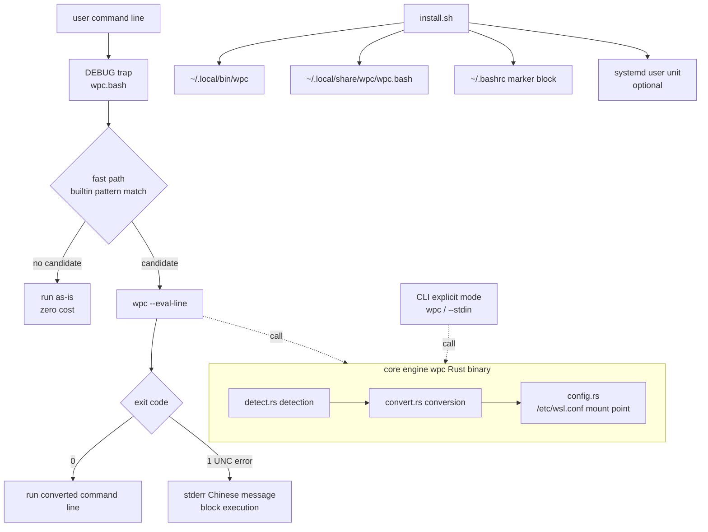

# wpc Software Development Plan (Phase 1, excluding tests)

> [English](development-plan.md) | [简体中文](development-plan.zh-CN.md)
>
> Version: v1.0 · Date: 2026-08-27
> Purpose: for other agents (the `path-convert-developer` agent) to complete the development tasks.
> Scope: **Phase 1 only (feature development)**; everything test-related (test framework, cases, test
> phase scheduling) is covered in the final section "Left for the Testing Phase" and is forbidden in this phase.

## 0. Key Decision Confirmation Record

> Confirmed with the user on 2026-08-27. These three are final decisions and must not be changed by dev agents:

1. ✅ Core engine language: **Rust** (zero-dependency single binary).
2. ✅ Interception mechanism: **bash DEBUG trap hook** (script scenarios use the `wpc` CLI explicitly; no LD_PRELOAD).
3. ✅ Service-state implementation: **bashrc hook auto-activation + systemd user placeholder unit** (no resident daemon).

## 1. Goals & Scope

### 1.1 Overall Goal

Install a tool inside WSL (Ubuntu, bash 5.2) that **transparently** converts Windows paths to WSL paths during daily use:

```bash
# user input
some_command C:\Users\username\Documents\file.txt
# actual execution
some_command /mnt/c/Users/username/Documents/file.txt
```

### 1.2 Phase-1 Deliverables

| Deliverable | Form | Corresponding skill |
|-------------|------|---------------------|
| core path conversion engine | Rust zero-dependency single binary `wpc` | `path-conversion-engine` |
| bash transparent integration | `shell/wpc.bash` (DEBUG trap hook) | `bash-preexec-integration` |
| install/uninstall & autostart | `install.sh` / `uninstall.sh` + systemd unit | `installer-and-autostart` |
| documentation | README, architecture doc, smoke record | `project-documentation` |

### 1.3 Non-Goals (explicitly excluded)

- Automated testing (test framework, test cases, CI) — left for a later phase.
- zsh/fish support — later phase.
- Windows-side tools (e.g. reverse conversion on PowerShell) — later phase.
- Automatic conversion in scripts / non-interactive scenarios (see §4.3 limits).

## 2. Requirements Analysis

### 2.1 Requirement Interpretation

| Original requirement point | Interpretation | Plan response |
|----------------------------|----------------|---------------|
| auto-start and enter service state when the distro starts | bash has no independent daemon to attach to; "service state" = the hook auto-activates at every interactive shell startup | bashrc injection + optional systemd user unit as the serviced representation |
| passing a Windows path as command/script argument auto-converts and executes with the replaced argument | interactive command line is top priority; script scenarios only in explicit CLI mode (`wpc` called by the script) | DEBUG trap interception + explicit CLI mode |
| transparent, no explicit call or prompt (except errors) | the conversion layer produces no normal-path output; only errors prompt | fast path is zero-output; errors go to stderr as Chinese messages |
| installed on WSL (ubuntu) | user-level install, no system pollution | `~/.local/bin` + `~/.local/share/wpc` |

### 2.2 Key Scenario List

| Scenario | Input | Expected |
|----------|-------|----------|
| S1 drive path in command arg | `cat C:\Users\x\a.txt` | runs `cat /mnt/c/Users/x/a.txt` |
| S2 path with spaces (quoted) | `ls "C:\Program Files\Foo"` | runs `ls "/mnt/c/Program Files/Foo"` |
| S3 mixed args | `diff C:\a.txt /home/u/b.txt` | only the Windows part converts |
| S4 forward-slash drive path | `cat C:/Users/x/a.txt` | runs `cat /mnt/c/Users/x/a.txt` |
| S5 UNC path | `ls \\server\share\x` | error message and block execution |
| S6 non-path false-positive guard | `echo C:`、`grep -E 'C:\\foo'` | not converted |
| S7 explicit call inside a script | `wpc 'C:\a.txt'` | outputs `/mnt/c/a.txt` (explicit mode, consumable by scripts) |
| S8 temporary disable | `WPC_DISABLE=1 cat C:\a.txt` | not converted |

## 3. Architecture Design

### 3.1 Component Diagram



### 3.2 Module Responsibilities

| Module | File | Responsibility |
|--------|------|----------------|
| CLI entry | `src/main.rs` | subcommand dispatch, exit codes |
| detection engine | `src/engine/detect.rs` | recognize Windows paths (context-aware) |
| conversion engine | `src/engine/convert.rs` | drive/separator/mount-point mapping |
| config | `src/config.rs` | read `/etc/wsl.conf` automount root, `~/.config/wpc/config.toml` |
| hook entry | `src/hook.rs` | `--eval-line` mode (whole-line rewrite of the raw command line) |
| shell integration | `shell/wpc.bash` | DEBUG trap, fast path, error handling |
| deployment | `install.sh` / `uninstall.sh` / `deploy/wpc-daemon.service` | user-level install, idempotent, reversible |

## 4. Technology Selection

### 4.1 Interception Mechanism Selection

| Candidate | Principle | Pros | Cons | Conclusion |
|-----------|-----------|------|------|------------|
| **bash DEBUG trap (preexec)** | trap captures `$BASH_COMMAND` before each prompt | pure bash, no system-level risk, reversible install/uninstall, handles the "command text" as a whole (spaces preserved) | interactive bash only | ✅ adopted |
| LD_PRELOAD intercepts execve | shared library replaces syscalls | works process-wide (incl. scripts) | high risk: crashes/security bypass; hard to debug; global pollution | ❌ too risky |
| shell function wrapping PATH | wrapper function per command | simple concept | must enumerate commands, cannot cover absolute-path calls, high maintenance | ❌ insufficient coverage |
| command_not_found_handle | triggers when a command is missing | simple | cannot intercept existing commands, only fills gaps | ⚠️ optional extra |

**Conclusion**: primary approach is bash DEBUG trap; `command_not_found_handle` is an optional extra (evaluate in a later phase).

### 4.2 Engine Language Selection

| Candidate | Pros | Cons | Conclusion |
|-----------|------|------|------------|
| **Rust** | zero-dependency single binary, microsecond execution cost (critical on the hook hot path), type safety | slightly higher dev cost | ✅ adopted (rustc 1.96 installed, no external crates) |
| Python 3 | fast to develop | interpreter startup ~30ms/call, unacceptable on the per-command hot path; depends on environment | ❌ |
| pure bash | zero deployment | complex escaping/quoting is error-prone; hard to handle spaces + quotes correctly | ⚠️ only as fast-path pre-filter |

**Conclusion**: core in Rust; bash only does the "fast-path pre-filter" to keep the vast majority of ordinary commands out of the engine.

### 4.3 Limits (explicitly accepted in this phase)

1. Interactive bash only (incl. `bash -i` loaded via bashrc); Windows paths written directly inside scripts are not auto-converted (scripts can use the `wpc` CLI explicitly).
2. UNC paths (`\\server\share\...`) cannot be mapped into WSL (no corresponding mount point), treated as an error.
3. A Windows path with spaces but unquoted has already changed semantics after word-splitting; the hook layer uses "whole-line rewrite" to restore as much as possible, but cannot cover every extreme case.
4. Relative drive paths (`C:foo`, no separator) are not converted.

## 5. Path Conversion Rules (engine implementation spec)

### 5.1 Detection Rules

1. **Drive absolute path**: matches `[A-Za-z]:[\\/]` at the start, with at least one non-whitespace character after it.
2. **UNC path**: matches `\\` at the start followed by a valid host-name start character (not `\`, whitespace, quote, or glob `*?[`); once recognized, mark it as error category `UnsupportedUnc` (no conversion result). Escaped/glob forms such as `\\*` or `[[ $cmd == \\* ]]` (seen inside completion functions) are not treated as UNC.
3. **Context constraints**: the candidate must be at one of the following positions, otherwise it is treated as a non-path and not converted:
   - start of line;
   - after a whitespace character;
   - after a quote (`"` or `'`) and the quoted content starts with the candidate.
4. **False-positive guard (do-not-convert list)**:
   - `C:` with no `\` or `/` after it (e.g. `echo C:`);
   - the candidate is part of a URL scheme such as `http://`, `https://`;
   - the candidate is inside an environment-variable expansion `${VAR}` or `$VAR`;
   - the case where the backslash itself is shell-escaped (in `BASH_COMMAND` it appears as `\\`; unescape before judging — implement per the actual `BASH_COMMAND` text).

### 5.2 Conversion Rules

1. Drive letter → lowercase; `\` → `/`; collapse consecutive `\` or `/` into one `/`.
2. Drive `X:` → `<root>/x`, where `<root>` defaults to `/mnt/`, resolved in order:
   a. `/etc/wsl.conf` `[automount] root` (if present and valid);
   b. `~/.config/wpc/config.toml` `mount_root` (if present);
   c. default `/mnt/`.
3. Quote style preserved: original double-quoted → output double-quoted; single-quoted likewise; unquoted → unquoted output.
4. Output does no shell escaping — the caller (hook execution-replacement strategy) is responsible for execution safety (see §6).

### 5.3 CLI Interface & Exit Codes

```
wpc <paths...>                # per-argument conversion, one per line; non-paths pass through unchanged
wpc --stdin                   # stdin multi-line → stdout line-by-line conversion
wpc --eval-line <raw command> # whole-line rewrite, for the hook
wpc --version
```

Exit codes: `0` success (incl. no match); `1` an unconvertible UNC exists; `2` usage error.

## 6. Execution Replacement Strategy (key difficulty)

bash has no native preexec; the "replace and execute" must happen without breaking the user experience:

1. **Capture**: read `$BASH_COMMAND` in the DEBUG trap (raw command-line text in interactive mode).
   - **Completion-context guard**: while readline TAB-completion runs, bash sets `COMP_LINE`/`COMP_POINT` and the DEBUG trap also fires for the completion function's internal commands (e.g. `[[ $cmd == \\* ]]`); those are not the user's real command line, so when `COMP_LINE`/`COMP_POINT` are set the hook skips conversion entirely (no fork, no block).
2. **Fast path**: bash builtin pattern `[[ $cmd == *[A-Za-z]:[\\/]* || $cmd == *\\\\* ]]` pre-filters; if it does not match, pass through directly (zero fork).
3. **Replace**: when the pre-filter matches, call `wpc --eval-line "$cmd"`:
   - Exit 0: get `converted`, execute by trying in order, taking the first feasible:
     a. write `converted` to a temp file + `source` it, while `history -s "$cmd"` keeps the user's original in history; or
     b. if (a) is not feasible, `eval` after a safety audit (see point 4).
   - Exit 1: print `wpc: 无法转换 Windows UNC 路径，命令未执行：<original>` to stderr and block execution; if `WPC_FALLBACK=raw`, pass through as-is.
4. **Execution safety**: `converted` boundaries are set only by the detection rules (§5.1 context constraints); replacement acts only on substrings recognized as paths, the rest of the command text is kept verbatim, no new escaping is introduced. **Do not** re-compose/rewrite the whole line a second time.
5. **Re-entry protection**: global flag `__wpc_in_hook=1`; before hook-internal commands (incl. the `wpc` call, `history` writes) run, set `WPC_DISABLE=1` in the environment and restore afterwards.
6. **Minimal perceptibility**: no extra terminal output on the normal path; command echo (except under `set -x`) and history keep the user's original text.

## 7. Security & Error Handling

| Risk | Mitigation |
|------|------------|
| hook recursion / infinite loop | `WPC_DISABLE` + `__wpc_in_hook` double protection |
| false conversion causing dangerous execution | context constraints (§5.1) + the fast path enters the engine only for clear candidates; `wpc` binary input never passes through a second shell parse |
| `wpc` unavailable/killed | the hook passes the original command through when the command is missing, never blocks the user |
| mount point customized by the user | the engine reads `/etc/wsl.conf` and user config; conversion results always match the actual mount |
| install pollution | all user-level paths; bashrc only appends a marker block; uninstall reversible |
| UNC cannot be converted | explicit error category + block + message; `WPC_FALLBACK=raw` escapes |
| Chinese/Unicode paths | Rust `String` handles UTF-8 end-to-end, no byte-level truncation |

## 8. Task Breakdown (TODO → skill)

> Per require.md: each TODO item becomes one complete skill (done, under `.github/skills/`).

| # | TODO (skill) | Output | Commit point | Depends |
|---|--------------|--------|--------------|---------|
| 1 | `scaffold-rust-project` | Cargo project + module skeleton + compilable binary | 1 commit | none |
| 2 | `path-conversion-engine` | detection/conversion engine + full CLI interface | 1 commit | 1 |
| 3 | `bash-preexec-integration` | `shell/wpc.bash` hook | 1 commit | 2 |
| 4 | `installer-and-autostart` | install/uninstall + systemd unit | 1 commit | 3 |
| 5 | `project-documentation` | README/architecture/smoke summary/acceptance check | 1 commit | 4 |

Execution order: 1 → 2 → 3 → 4 → 5 (strictly serial; commit after each step).

## 9. Phase-1 Acceptance Checklist (manual smoke, not automated tests)

> Passing all items completes phase 1. Summarized in `docs/smoke-checklist.md` by the `project-documentation` skill.

- [ ] A1 `wpc 'C:\Users\x\a.txt'` → `/mnt/c/Users/x/a.txt`
- [ ] A2 `wpc 'c:/foo/bar'` → `/mnt/c/foo/bar`
- [ ] A3 `cat C:\Users\x\a.txt` in an interactive shell (a real existing /mnt/c file) executes transparently with no extra output
- [ ] A4 `ls "C:\Program Files\..."` quoted path with spaces converts correctly
- [ ] A5 mixed args: only the Windows part converts
- [ ] A6 UNC input → Chinese message + not executed + exit 1
- [ ] A7 `echo C:`、URL、`${VAR}` not false-converted
- [ ] A8 ordinary command (no path) zero output, zero extra processes (`set -x` observation)
- [ ] A9 `WPC_DISABLE=1` fully disables
- [ ] A10 temp-HOME install → new `bash -i` auto-activates → uninstall → fully removed
- [ ] A11 two consecutive installs idempotent
- [ ] A12 `cargo build --release` green, no warnings, binary < 1 MB
- [ ] A13 `systemctl --user status wpc-daemon` OK when systemd is available

## 10. Left for the Testing Phase (forbidden in this phase)

1. Automated test framework & cases (engine unit tests, hook integration tests, installer script tests).
2. CI pipeline (build/test/lint).
3. Fuzzing (path input space).
4. Performance benchmarks (quantify hook hot-path overhead).
5. zsh/fish compatibility tests.
6. Gray-scale install verification on the real `~/.bashrc`.
